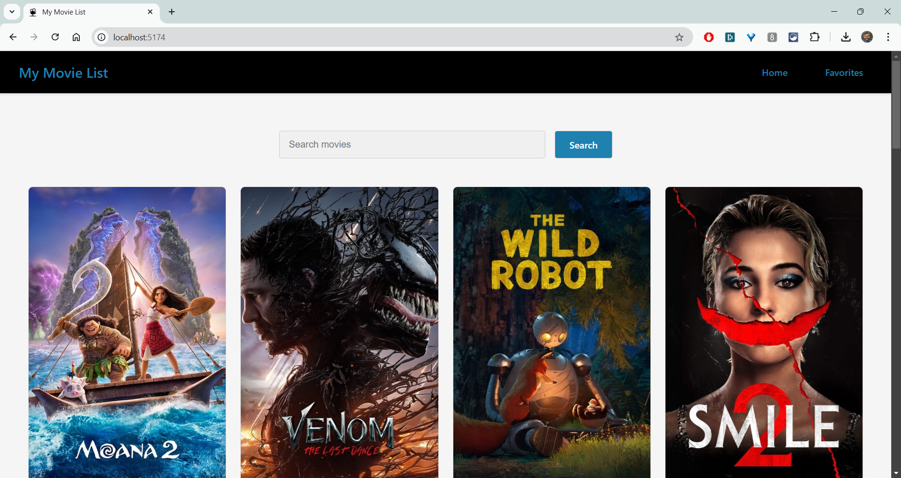

# My Movie List


## Description

**My Movie List** is an app that lets users search for movies and save their favorites to a dedicated "Favorites" page. Users can easily add or remove movies from their favorites, making it a great tool for organizing and keeping track of movies they love.

---

## Features

- Search for movies from the [TMDB API](https://www.themoviedb.org/documentation/api).
- Save favorite movies and view them on the "Favorites" page.
- Add or remove movies from the "Favorites" list.
- Responsive and user-friendly design.
- Built with **Vite** for fast performance and optimized builds.

---

## Table of Contents

- **[Installation](#installation)**
- **[TMDB API Key Setup](#setup)**
- **[Usage](#usage)**
- **[Deployment](#deployment)**
- **[Resources](#resources)**
- **[Contributing](#contributing)**
- **[Questions](#questions)**
- **[License](#license)**

---

## Installation

To install the necessary dependencies, clone the repository and run the following command:

```bash
npm install
```

## Setup

This app uses the TMDB API to fetch movie data. To use the app, you'll need to obtain your own API key:

1. Create a free account at [TMDB](https://www.themoviedb.org/).
2. Navigate to your [API settings](https://www.themoviedb.org/settings/api) and request an API key.
3. Once you have your API key, create a `.env` file in the project root and add the following line:

   ```bash
   VITE_API_KEY=your_api_key_here
   ```

## Usage

To start the app locally with Vite, run:

```
npm run dev
```

Visit the app in your browser at the address provided in the terminal (usually http://localhost:5173).

## Deployment

The app is live at: [My Movie List](https://pav85.github.io/react-movie-app/)

Here’s a preview of the app:



---

## Resources

- **API**: [TMDB API](https://www.themoviedb.org/documentation/api)
- **Technologies**: React, Vite, JavaScript, CSS

---

## Contributing

Contributions are welcome! Fork this repository and submit a pull request with your changes.

---

## Questions

For any questions or inquiries, feel free to reach out via email or GitHub:

- **Email**: [pawel-werbowy@gmail.com](mailto:pawel-werbowy@gmail.com)
- **GitHub**: [Pav85](https://github.com/pav85)

---

## License

This project is licensed under the MIT License.
